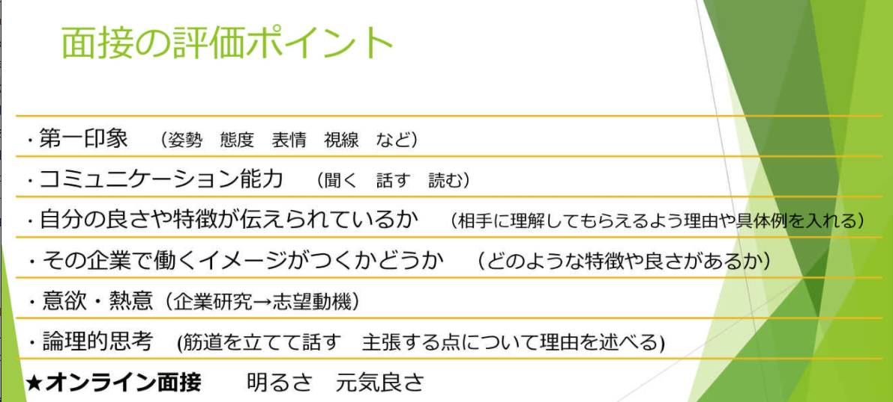
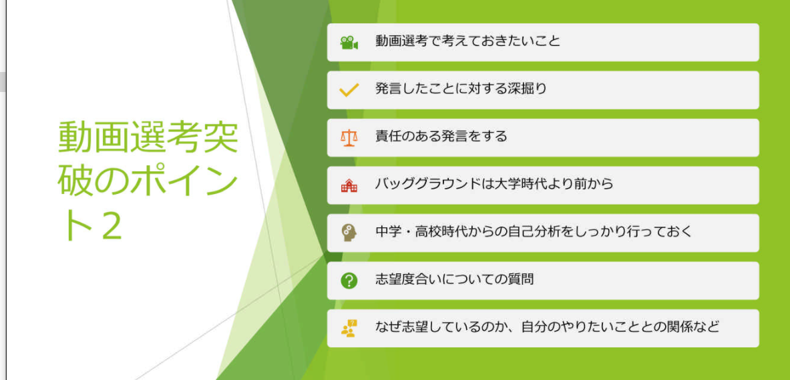

## 自己分析

+ 自分のよさ、特徴、らしさ　=自己分析のキーワードを見つける
+ キーワードが正しいかどうか
+ これらを裏付けるエピソードを大学時代のことで最低でも5つあげてみる

## 面试

面接とは

+ 聞かれたことを通じて、**自分がどのような人間であるかを伝える場**
  - 着地点は全て　「**自己分析のキーワード**」

面接の入口

+ 面接担当者からの質問のこと
+ 質問は基本の質問から、変化球的な質問まである

出口

+ **自分がどのような人間であるかを伝える場**
  - 把每个自己的特点  尽可能融入到每个问题里

------------------------

面试的point

+ 1个问40~45   300字以内
+ 结论---***理由***----具体例----结果
+ 志望動機はその企業にだけ通用するものを考えておく
+ 身だしなみ～マナーにも気を付ける

动画选考

## 问题例

+ Q自己PR(あなたの良さ、特徴、あなたらしさ)
  - A私はやると決めたことは最後までやり通すことができる
  - **理由最重要，为什么能坚持到最后**
+ Q学チカ
  - A吹奏部活动
  - **为什么这个最努力 理由理由**。比如可以回答上一问的A

+ Q最近开心的事
  - A被推荐为サークル副部长
  - 这种回答完全没有意义,往本质上靠 **自分がどのような人間**
+ Q打工失败谈
  - A没记住工作，被顾客投诉
  - 完全不行，要渗透**自分がどのような人間**
+ Q兴趣/感兴趣/关心的人物
  - A任意人名
  - 这个人要和**自分がどのような人間**一个性格
+ Q印象 残 新闻
  - A业界相关
  - 不强求，能搭上**自分がどのような人間**也可以
+ Q代表你的颜色
  - A任意颜色所代表的性格
  - 重点是**自分がどのような人間**，能表现出这个性格的颜色是什么
    - 例：私はやると決めたことは最後までやり通す
           こと 像火一样热血，炙热的目光 所以是红色
+ Q地铁站走过来的路上，印象 残 广告/看板
  - A任意广告/看板
  - **自分がどのような人間** 表现出
+ Q目前为止，最苦劳的

