# 日興システムソリューションズ

##  基础

+ 要件定義
  - needs/战略/效率化 制度变更
  - 顧客の目的理解ーー聞き出す、聞き取る力
  - 顕在&潜在要件
  - 要件書
    - テーブル、受渡ファイル
  - プログラム仕様書
+ 設計
  - 記述、実述、資料
  - 具体的　定義　要件
  - どう作るーー要件定義に則った内容であること
  - 設計書
    - 画面、帳票、処理機能
+ 製造
+ テスト
+ 運用保守
  - 監視、キャパシティ、災害対策、障害復旧
  - 定期保守、プログラム移行

## 视频截图

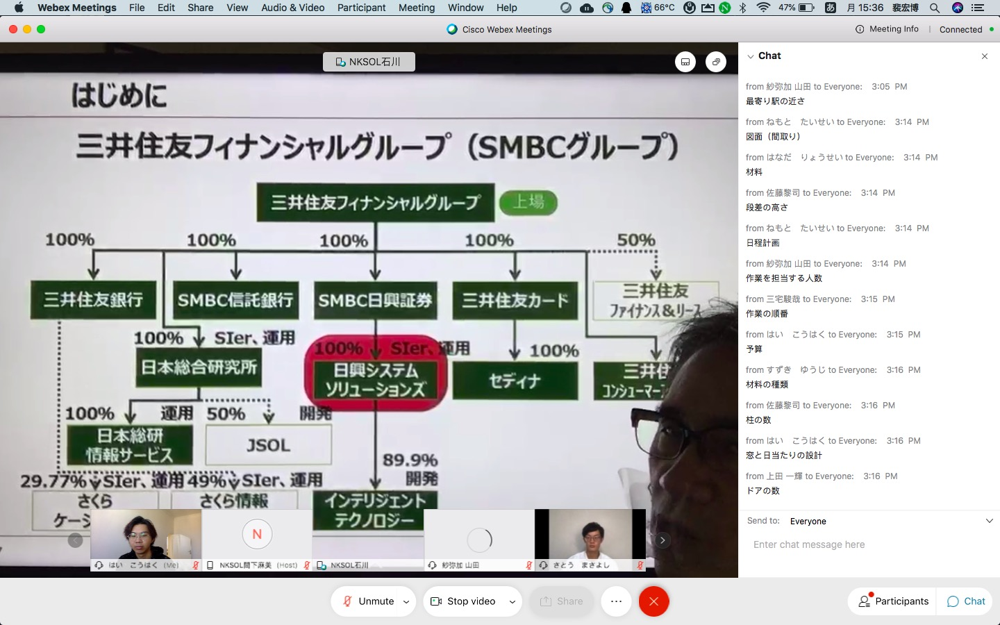

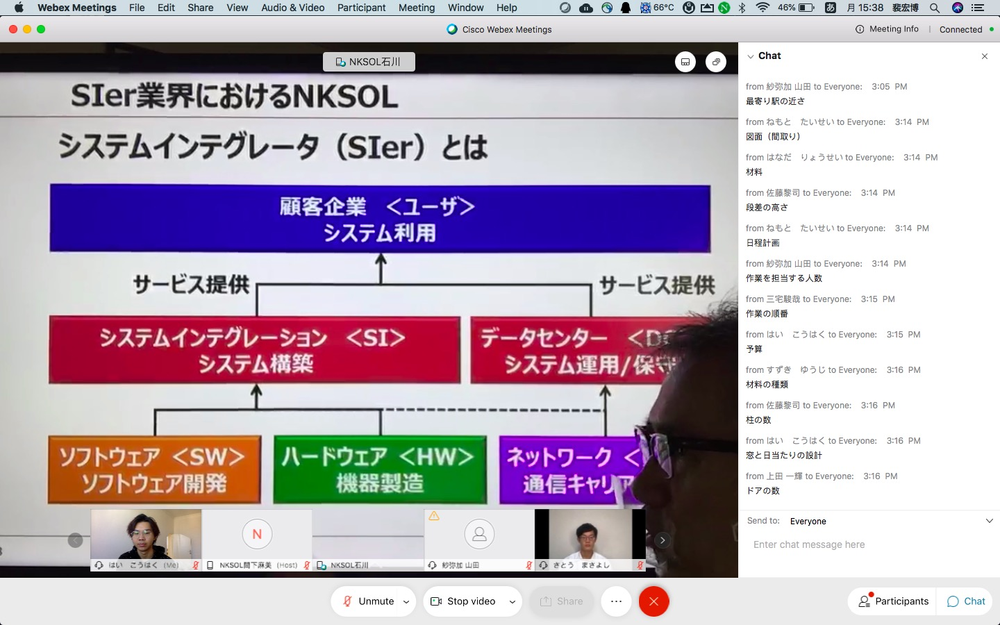

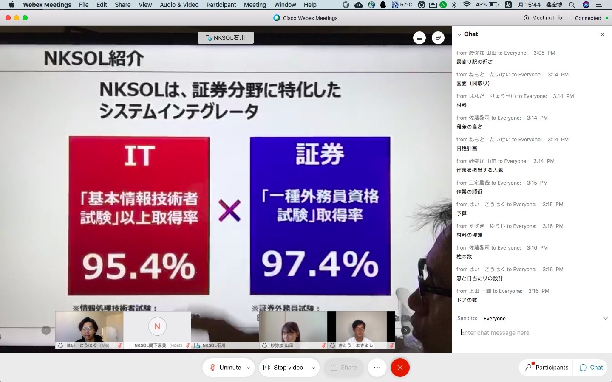

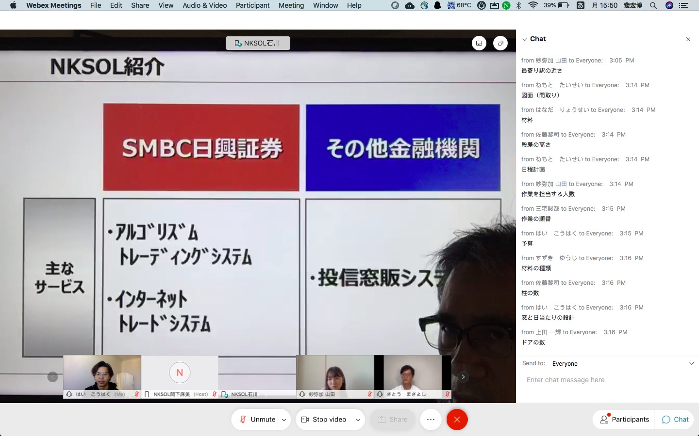

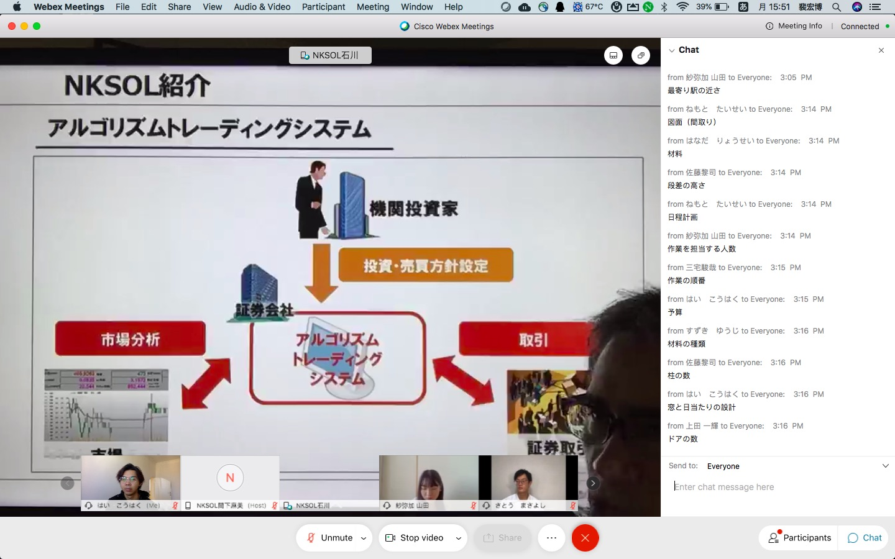

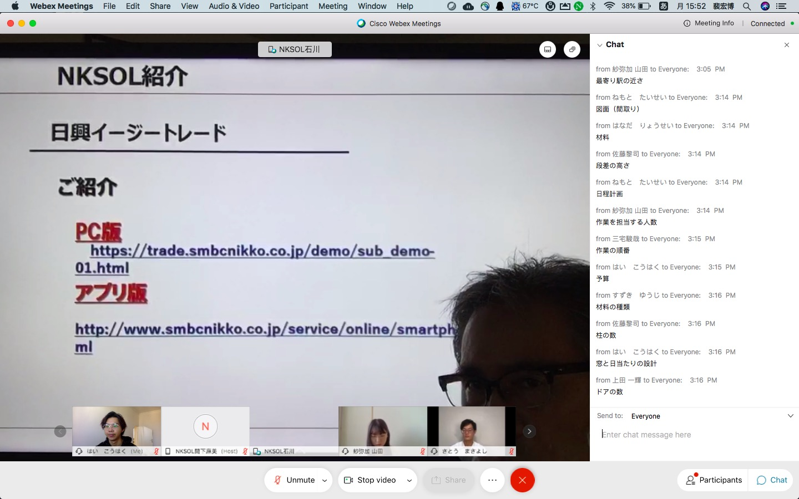

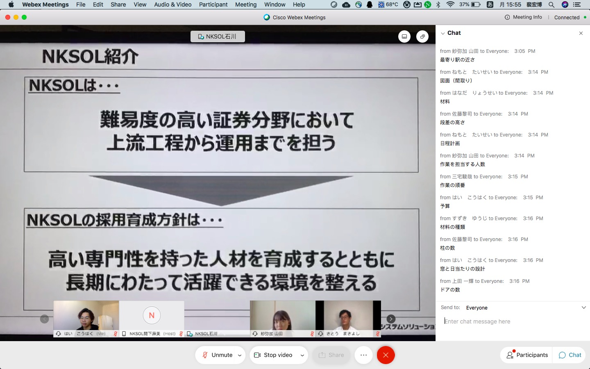

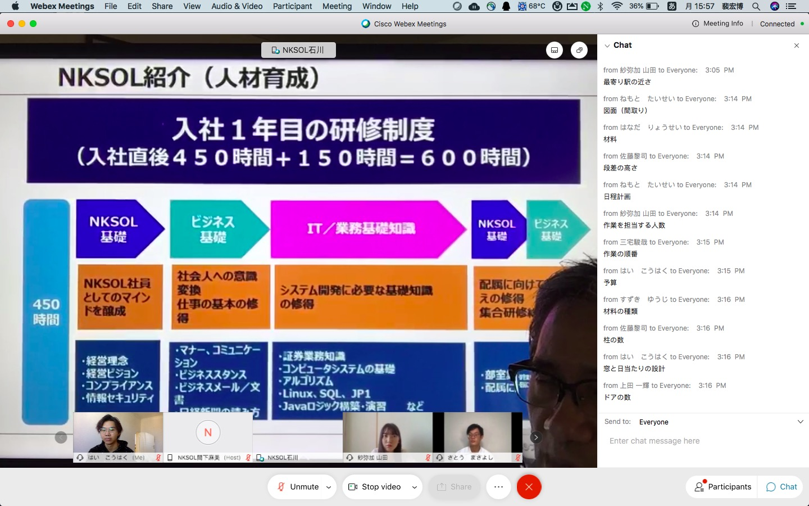

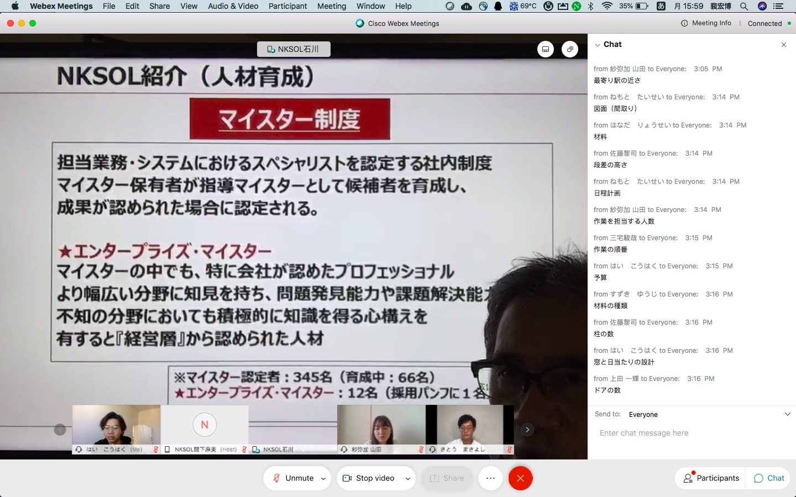

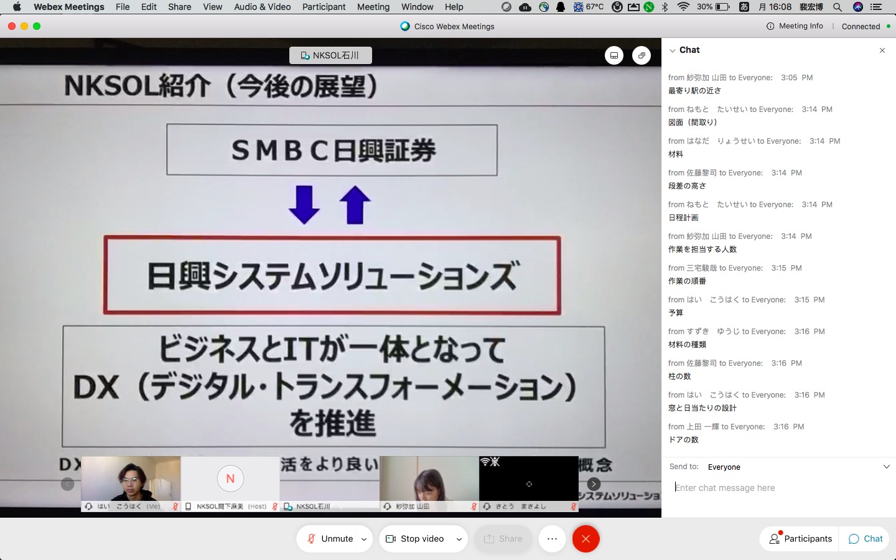

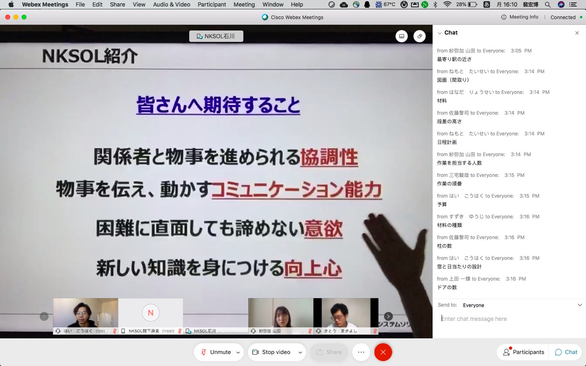

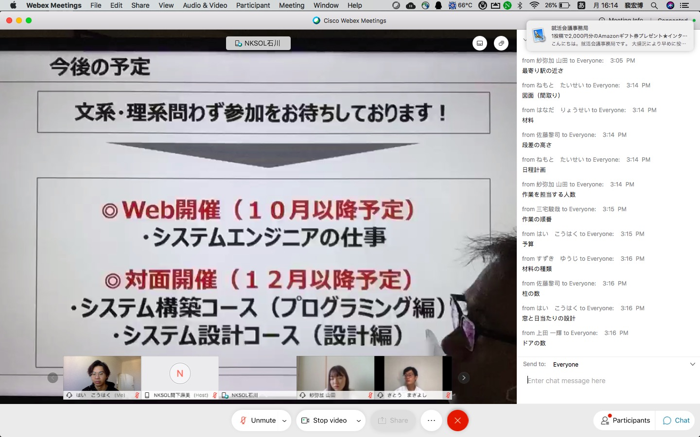

## DX

2020年、新型コロナウイルスの感染拡大による社会的なショックを受ける前から、日本では少子高齢化による人手不足などの影響で、デジタルによる業務変革の重要性が高まっていました。そして、新型コロナウイルスの感染拡大により、企業が予測できないリスクに迅速に対応したり、オンラインが前提の業務を行うために、デジタル化がどんどん加速しています。

海外に視線を向けると、「GAFA（Google、Apple、Facebook、Amazon）」や中国の「BAT（Baidu、Alibaba、Tencent）」など、さまざまなグローバル企業の存在感が高まってきました。これらの企業が急成長し大成功できたキーワードの一つが、デジタルでビジネスを変革する「DX（デジタルトランスフォーメーション）」です。大規模なITプラットフォームを有するこれらの世界的企業は、私たちの生活を大きく変えてきました。

今後、DXが推進されていく中で、新しいビジネスモデルが生まれ、人々のライフスタイルが大きく変わっていくでしょう。

しかし、日本におけるDXを担う人材が圧倒的に足りていないのが実情で、これからDXを担う人材の育成も注目されてくると思います。

この記事では、そもそもDXとは何かを説明し、国内外のさまざまな分野における活用事例まで紹介していきたいと思います。

DX（デジタルトランスフォーメーション）とは？定義を解説

スウェーデンのウメオ大学のエリック・ストルターマン教授が2004年に提唱したDX（デジタルトランスフォーメーション）の定義は以下です。

人間の生活に何らかの影響を与え、進化し続けるテクノロジーであり、その結果、人々の生活がよい方向に変化する。

日本経済産業省は2018年に発行した「デジタルトランスフォーメーションを推進するためのガイドライン（DX推進ガイドライン）」にて、以下の定義をまとめています。

企業がビジネス環境の激しい変化に対応し、データとデジタル技術を活用して、顧客や社会のニーズを基に、製品やサービス、ビジネスモデルを変革するとともに、業務そのものや、組織、プロセス、企業文化・風土を変革し、競争上の優位性を確立すること。

エリック・ストルターマン教授による定義は、私たちの生活全般に及ぶ広義なものですが、**経済産業省によるDXの定義はビジネス視点に限定したもの**になっています。

現在話題になっているDXの多くは、経済産業省が定義したようにビジネス視点でのDXが主で、企業がいち早く外部環境・内部環境の変化を捉え、デジタルの力を使って最適な経営戦略に導くことによって、新しい価値創出することが重要になっています。

なぜDXが注目されてきたのか

DXは2004に提唱された概念ですが、実は2019年頃からようやく注目され始めました。「遅い！」と思うかもしれませんが、この10年間で革新的なテクノロジーが社会に浸透してきたことが大きなきっかけです。

DX注目のきっかけになった「2025年の崖」

日本で急にDXが注目されるようになった大きなきっかけの1つは、2018年9月7日に経済産業省が発表した「DXレポート：ITシステム「2025年の崖」克服とDXの本格的な展開」（略称：DXレポート）です。DXレポートの中で「2025年の崖」という言葉とともに、日本の企業の旧態依然とした姿に警鐘が鳴らされています。

まず「2025年の崖」の内容は大きく分けて以下の3点です。

\1. 市場に対応できないと、デジタル競争の敗者になる

\2. システム維持管理費がIT予算の9割以上を占め、技術的な負債が起きる

\3. システムトラブルやデータの滅失リスクの高まり

DXレポートでは、もしDXが実現ができなければ2025年以降、最大で年間12兆円の経済損失が生じると予測されています。

その一方で、もしDXが実現できれば2030年に実質GDP130兆円超の押し上げができるとも述べられています。

日本企業が持続的に競争力と生産力を保つためには、DXの推進が不可欠であると経済産業省は呼びかけています。

DXを支えるテクノロジーの進化

DXが注目を集める背景には、2010年代の急激な技術発展があります。

**ビッグデータ**

スマートフォンの普及などにより私たちはさまざまなサービスを活用できるようになりました。それと同時に膨大なデータが蓄積され、ビッグデータとして、その活用方法に注目が集まっています。今、データは「**Data is the new oil（データは新しい石油だ）**」とも例えられるほど重要性が増しています。

ビッグデータは大量のデータだけを指すものではありません。「さまざまな形をした、さまざまな性格を持った、さまざまな種類のデータのこと」を指します。ビッグデータにおいて、量（Volume）・種類（Variety）・更新頻度（Velocity）の3Vが重要な要素になっています。

ビッグデータが蓄積されることでシステム同士の連携がスムーズになるだけでなく、高度な分析や予測などが可能になりDXにおいてもデータの活用が特に重要です。

**AI（機械学習・ディープラーニング）**

AI（人工知能）の技術が発展したこともDXへの注目が高まったきっかけです。

AIを単なる技術の1つと捉えた場合、それはDXを構成する1つの要素に過ぎません。しかし、DXにおいてデータの価値が再認識されるようになっています。データを大量に集め、AIを活用して大量・短時間処理することによって、新しい知見を得ることできます。

AIが人間の脳のような働きをし、DXにおける多様なデジタル技術をつなぎ、総合的な価値を生み出し、世の中を劇的に変えていくでしょう。

**5G**

5Gはあらゆるデバイスがインターネットにつながり、高速でデータをやり取りするIoT時代の主役とも言える技術です。超高速、大容量、低遅延に通信できるといった特徴がある５Gは、医療現場、工事現場、また自動運転領域で新しいソリューションサービスを生み出すことができます。5Gが企業にとってDX推進のドライバーとも言えます。

**VR・AR**

現在、ゲーム、医療といった分野でARやVRの活用が進んでいます。時間や場所の制約がないというメリットから、今後さまざまな場面の需要が増え、DXとイノベーションの創造をより一層推進することが期待できます。

**クラウドサービス**

クラウドサービスは、従来は利用者が手元のコンピュータで利用していたデータやソフトウェアを、ネットワーク経由で、サービスとして利用者に提供するものです。代表的なものとしては、Amazon Web Services（AWS）やMicrosoft Azureなどが挙げられます。

クラウドサービスは、既存システムの価値向上に向けて、インフラ刷新のために幅広い選択肢を与えられることにより、DXの推進、DXの底上げ2つの視点から活用されています。

デジタイゼーション／デジタライゼーションとの違いと関係性

デジタル化という文脈では、DX（デジタルトランスフォーメーション）だけでなくデジタライゼーションやデジタイゼーションなどの言葉も頻繁に使用されます。これらの言葉はしばしば同じような意味として使われることもありますが、厳密にはその意味が異なります。

この3つの言葉の違いを明確にすることで、DXを進める上での理解が深まります。まずは以下の画像をご覧ください。

デジタイゼーション（Digitization）

わかりやすく表現すると、**デイタイゼーションは紙やフィルム、音などのアナログデータをデジタル形式に変換するプロセス**を指します。また、人間の健康データなど物理的な情報をセンシング技術を活用してデジタル化するプロセスも含まれます。

デジタイゼーションなしにデジタライゼーションやDXを実現することはできません。

紙の書籍を電子化したり、テキストをOCR機能で電子化することがデ自体ゼーションの例です。

データが企業にとっての重要な資産になっている今、さまざまなアナログデータを電子化し、コンピュータが扱えるようにすることで、分析や予測を行うことが可能です。

特に近年注目を集めるAI技術の導入を進めていく上で、デジタイゼーションは必須のプロセスといえるでしょう。

デジタライゼーション（Digitalization)

デジタライゼーション（Digitalization)とは**デジタル技術やデータを活用することで、ビジネスフローやビジネスモデル、ビジネスプロセスなどを改善、変革していくプロセス**です。

自動車を物理的に所有するというビジネスモデルからカーシェアリングモデルに変換したり、パッケージごとに売られていたソフトウェアのサブスクリプション化はビジネスモデルの変革の例と言えます。

また、RPA技術を活用して業務を自動化したり、SaaSを活用して社内の事務手続きを簡略化するなどビジネスフローをデジタル技術で改善していくこともデジタライゼーションに含まれます。

デジタイゼーション、デジタライゼーションが

DXにつながる

**DXを進めていく上で重要なことは、デジタイゼーションやデジタライゼーションを積み重ねビジネスモデル、業務、組織、プロセス、企業文化・風土など、企業内のあらゆる側面で変革を起こしていくこと**です。

それがひいてはDXの実現に繋がります。

昨今では、多くのDX関連の事例が生まれたり、AIやRPAの活用が進んでいます。しかし、それは点でしかありません。厳密には、そのほとんどがDXの事例というより、デジタイゼーションがデジタライゼーションの事例とも言えます。

DXはビジネスモデルから業務、風土まで領域が幅広く、一朝一夕で実現できるものではありません。この視点をもとに、デジタイゼーションやデジタライゼーションを重ね、DXの実現に向けて歩み続けていきましょう。

DXのメリット

業務が効率化：コスト削減、利益率と売上拡大

DXの過程でデジタライゼーションを行っていくことで、レガシーシステム（老朽化したシステム）から脱却できます。

レガシーシステムとは時代遅れの古いシステムを指すIT用語です。システムの維持に費用がかかったり、運用・保守に工数がかかるなど、会社にとって重荷です。また、時間経過によってめまぐるしく変化するIT分野において、レガシーシステムは柔軟なシステム更新に向いていません。

時代に即したシステム環境を構築することによって、システム維持費用や労力の無駄な部分をスリムアップすることでコスト削減と効率化が図れます。特に近年では、企業の基幹システムをクラウド化し簡単に情報を共有できる仕組みなどを取り入れる企業も増えています。また、レガシーシステムを更新し、運用や保守のコストを下げることができれば、利益率の拡大が図れます。

新しい価値創出による新たな収益基盤

DXの過程で事業変革を行う（デジタライゼーション）ためには、顧客の価値を中心に考えることが重要です。顧客に提供する価値を考え、創出することで新たな事業に繋がり、自社にとって新たな収益基盤を構築できるかもしれません。

近年では、顧客の価値を中心に据えた開発手法なども確立してきており、多くのベンチャー企業が誕生しています。新しい価値観に合わせたこれまでにないビジネスモデルを創出することで、事業を拡大可能です。自社の成功体験や内部環境に縛られやすい国内の大企業などが顧客への価値に基づいた事業を提供していくことも求められます。

例えば、Amazonは本来「書籍の通販サービス」のECプラットフォームでしたが、「顧客中心」の改善を繰り返した結果、今書籍だけではなく、食品、衣料品など、さまざまなものを購入できる、世界で愛されているサービスに成長しています。

DXを実現することによって、顧客のニーズや利便性を拡充し、サービスの「使いやすさ」を追求することで、事業やサービスが本来の姿と異なる特性を持ち合わせ、新しい価値創出に繋がります。

DXのデメリット・懸念点（ハードル）

費用対効果

DXの導入には大規模なコストがかかります。加えて結果が出るまでに時間がかかる場合もあるので、長期的な資金の確保も必要です。

IDC Japanによると、実際DXの効果を実感していない企業は4割も占めていますので、企業にとって長期的な目線でDX推進の計画と開発費の見積もりが必要不可欠です。

レガシーシステムの再生産

「DXレポート」にも記載されているように、現在の日本企業の多くは旧式の基幹業務システム、いわゆるレガシーシステムを利用しています。人手不足、技術面の老朽化、システムの誇大化・複雑化によりその内部がブラックボックス化しているため、運用から維持まで困難な状況に置かれています。

しかし、既存システムから新しいシステムの移行が非常に困難となり、なかなか導入まで踏み切れないことも考えられます。「DXを名目に新しいシステムに移行しようとしたけど、部分的にしか刷新できず、さらに複雑になってしまった」などとならないように注意しましょう。

企業が目指すDXの姿を徹底し、これらの問題点を解消するためには、企業の基幹から見直し、新しいシステムへと移行することを検討するべきではないでしょうか。

DXを全社に広げられない

多くの企業がDXをスローガンとして社内で唱えるようになりますが、結局、DXが「ある部署だけ」、「ある業務だけ」になりがちで、単なるデジタイゼーション、デジタライゼーションで終わってしまっているケースが散見されます。

DXの導入に関わる企業内変革において、会社全体に影響を及ぼすような大きな取り組みは非常に大きな労力と困難を伴います。

そのためには、小さく早い成功を積み上げることが大事となります。また、成果をしっかり数字で示し、経営層をはじめ従業員の納得感を得ながらDXを進めていきましょう。

まず自社の状況を把握した上、小規模な施策から取り組み、どんどん対象範囲を広げていくことが確実な進め方です。

DXから考える: as a Service化(XaaS)

ここ数年あらゆるものが「as a service化」（略称：XaaS)し始めています。XaaS化は商品やサービスをクラウド経由で提供し、オンラインでサービスを提供することです。この新しいビジネスモデルの構想は、DXで重要な一部分です。

SaaS

SaaS(サース)は、「Software as a Service」の略語です。直訳すると「サービスとしてのソフトウェア」です。

多くの企業では、ソフトウェアが自社のコンピュータにインストールされ、そのコンピュータのみでしか稼働できない場合があります。

しかし、SaaSでは、ソフトウェアを利用者側に導入するのではなく、ネットワーク経由で提供し、ブラウザやアプリケーションを簡単にインストールして、利用者がサービスとして利用できます。

例えば、コミュケーションツールのSlack（スラック）、顧客管理（CRM）や営業支援システムとして米国のSalesforce（セールスフォース）などが挙げられます。

MaaS

MaaS(マース)は、「Mobility as a Service」の略語です。直訳すると「サービスとしてのモビリティ」です。

ICT を活用して交通をクラウド化し、マイカー以外のすべての交通手段によるモビリティ（移動）を ひとつのサービスとしてとらえ、シームレスにつなぐ新たな「移動」の概念です。

例えば、米国の自動車配車プラットフォームのUber（ウーバー）、中国の大手ライドシェア企業「滴滴出行（ディディチューシン）」などが挙げられます。将来的には、自動運転車が当たり前のように街中を走行し、タクシーのコストが大幅に低減、自家用車を所有する人もすくなるかもしれません。

IaaS

IaaS(イァース)は、「Infrastructure as a Service」の略語です。直訳すると「アプリケーションを開発・利用するためのインフラとしてのサービス」です。仮想サーバーやハードディスク、OSはネットワークをクラウド上で提供するサービスです。カスタマイズ性が非常に高いと言われます。

例えば、Amazonが提供する「Amazon Elastic Compute Cloud （Amazon EC2）」 、マイクロソフトが提供する「Microsoft Azure」、Googleが提供する「Google Compute Engine（GCE）」などが挙げられます。

DX人材に必要基礎知識・スキル

DXに取り組む企業にとって、DX関連の知識やスキルを持った人材の重要性が高まっています。その人材になるために、どんなスキルが必要でしょう？

Computational Thinking（計算論的思考）

Computational Thinking(計算論的思考)と呼ばれる思考法は俯瞰的に物事を見て、関係性を理解した上で、仕組みを再構築できることです。DX化にはシステムの企画・開発・導入が必須であるため、この思考法がを身に付けないと大変だと考えられます。

この思考法は4つの力から構成されています。

\1. Decomposition：問題の分解力

複雑な問題を細かく分解する

\2. Decomposition：パターンの発見力
物事の周期性や法則性を発見する

\3. Abstraction：抽象化する能力
問題の一番大切な部分だけを抜き出す

\4. Algorithm Design：手順化する能力
手順を明確にして段階を踏む

IT技術全般の理解

IT技術というと、プログラミングができるエンジニアの仕事を想像する人もいるかもしれません。IT技術が当たり前のように私たちの周りにありふれた今、エンジニアだけでなくすべての人が、ITに関する幅広い基礎知識を得て行くことが重要です。

DXでは、さまざまな技術を活用し、デジタイゼーションやデジタライゼーションが行われます。技術をしっかり理解していないと、どの課題をどの技術で解けるのか、その技術の課題やリスクはどうなのか、今後の計画をどのようにたてるのか、などの視点を持つことができません。

DXにおけるデータの重要性

DXにおいて、最も重要な資産はデータです。以下の点においてデータが重要になっています。

DXが重要になる2020年代はデータ・ドリブン（Data Driven）やデータ駆動がキーワードになります。

効果測定などで得られたデータをもとに次のアクションを起こしていくことで、未来が予測できない中、的確な施策を実施していくことができます。

簡単に言うと、企業に日々蓄積されるさまざまなデータを材料として使い、分析することによって、業務プロセスの最適化や顧客体験の強化、ビジネスモデルの改革などによる価値創出を目指すことです。

DXはデータがとても重要です。理由は3つあります。

1.「よりよい意思決定」：データ分析によって何をなすべきかについての最善の提案をする

2.「すばやい意思決定」：過去データに基づいて、これから何が起こるのかをすぐ予測する

3.「意思決定の自動化」：条件に応じて機械的に判断すれば足りる場合は、人間が判断する必要がない

これからの時代、企業経営で一番大切なのは「意思決定」です。「意思決定」を可能な限り自動的、もしくはデータをもとに自動的に行うことにより、「守るIT」から「攻めるIT」への転換が可能となり、DX推進に向けたカギを握ります。

DXにおけるUXの重要性

UXはUser eXperience（ユーザーエクスペリエンス）の略です。

UXは「ユーザーが、ひとつのモノ・サービスを通じて得られる体験」を意味しています。このユーザーの体験を改善することで、利用者にとって製品・サービスの価値を向上させることを目的としています。

なぜUXの向上がDXの実現に近くのでしょうか？

UXには、システムの利用前・利用中・利用後に起こる、ユーザーの感情、信念、嗜好、知覚、生理学・心理学的な反応、態度、達成感の全てを含む概念です。

先述のように、DX化は「顧客中心」が大前提となっています。UX改善によって既存の体験の劇的な改善と新しい層の取り込みができますので、ユーザーに持続的に価値提供をしていく際にUXがとても重要です。

DX活用事例

娯楽・エンタメ

娯楽領域では特に早くDX化が進んでいます。

今回紹介したいのはNetflixの成功事例です。Netflixは1998年にウェブサイトによるDVDレンタルサービスを開始し、2007年からストリーミング配信サービスに移行しました。

2013年にはビッグデータを活用したオリジナル作品の制作を開始、サービスを提供する国は2016年まで130カ国に拡大し、現在世界の合計190カ国以上、21言語の会員にサービスが提供されるようになりました。

Netflixの取り組みで成功した理由は、ストリーミング配信へのビジネスモデル変換（デジタライゼーション）でした。また、ビッグデータの活用とともに、より多くの人が興味を持っているコンテンツを持続的に提供できるようになりました。

その他にも、娯楽やエンタメの領域では、ストリーミング配信の仕組みを取り入れたDX関連の事例が多く生まれています。

医療

医療領域でもさまざまなDXが進んでいます。医療分野では従事者の就労環境の悪化や少子高齢化による社会保障費の増大が続き、課題が山積しています。

そのため、プライバシーを守りながら医療データを効率的に活用し、さらに電子カルテなど紙のデータを廃止するなど、業界全体のスリムアップが求められています。

また、医療分野ではAIの活用も進めています。ここで紹介したいのは「AI問診Ubie」です。患者ひとりひとりの症状にあわせてAIが質問を自動生成し、広範かつ深堀りした問診が可能になります。

その結果、AIによって問診業務を1/3にまで削減でき、混雑時間の外来の待ちが解消されたり、看護師が問診業務から受付事務に割く時間を増やせるといった効果がありました。

AIの活用に留まらず、医療領域では今後もさらなるDXが求められています。

教育

教育領域でもDX化が進んでいます。

国内では教師不足が課題になるほか、長年に渡って進化しておらず、デジタル技術を活用した抜本的な改革が必要です。特に近年では、求められるスキルが大幅に変動しています。

従来のように、全員に同質の教育を提供する形ではなく、データを活用して一人ひとりに合わせた教育を提供していくことも必要です。また、今後はIT関連の科目を取り入れ、ITリテラシーを持った人を増やす努力が大切です。

ここで紹介したいのはベネッセが開発したダブレットを使った学習ソフト「ミライシード」です。授業前に生徒からアンケートの回答により、学習意欲や苦手分野など結果データに基づき教師に授業方法や内容を助言します。

また、このソフトを用いて、授業を通じた学習意欲の変化や理解度を測り、次の授業で改善します。児童の苦手分野見える化にさせ、オンライン教育の強化が図れます。

物流

国内ではWebを通した購買行動が活発化しています。Amazonや楽天をはじめとしたECサイトが台頭し、合わせて宅配便荷物数が年々増大しています。

もし、自動運転が実現し、ロボットが宅配する社会が訪れれば、多くの課題が解決されるでしょう。しかし、今それを担えるのは人間だけです。

一方で、データを活用したり、SNSを活用して不在配送を減らす取り組みなども積極的に行われています。

例えば、ニトリホールディングス（HD）がブロックチェーンを利用した新たな物流システムの稼働に取り組んでいます。まず、ブロックチェーンを使い、物流に関わる情報を電子化させ、サプライチェーン全体で納期を短縮します。

また、提携運送会社のドライバーがどんなスキルを持っているかを把握し、専門知識が必要な商品の配送難を解消でき、最適な人員配置を目指します。ニトリはDXの加速により、新型コロナウイルスの感染拡大の中でも売上が増加しています。

金融

金融領域でもさまざまなDX化が進んでおり、金融の在り方を変えていきます。

金融領域で、まず課題になるのは「紙文化」といえます。今でも多くの書類が存在し、紙を通してさまざまな手続きが行われています。現在は多くの銀行がスマートフォン向けのアプリケーションや、Webサイト上で各手続きができるようにデジタライゼーションが行われています。

また、紙のデータを電子化するOCR技術の活用も進んでいます。今、AIを活用したAI-OCRを使えば手書きの文字でもほぼ100%の精度で電子化可能です。

みずほフィナンシャルグループは、2019年度に発表した5カ年経営計画で「次世代金融への転換」を掲げました。デジタル化技術を活用したコンサルティング中心の次世代店舗の展開やペーパーレス化の推進、法人顧客へのデジタル戦略の提案など、あらゆる業務領域でデジタル対応を進めます。予測不可能の環境変化に応じて、「金融を巡る新たな価値」を創造することを目指します。

農業

人手不足で深刻化になった農業でもDX化が進んでいます。

北海道にある株式会社Kalm 角山は、多数の搾乳ロボットの導入により、大規模酪農経営での省力化と、効率的な飼養管理等を実現しました。牛舎に、自動搾乳ロボット8台（1農場の台数としてはアジア最大級）を導入し、作業効率の向上・生産コスト削減を図りました。

搾乳ロボットと連動し、個体毎の生乳中の成分分析により、疾病や繁殖管理が可能な機器を導入。繁殖効率の向上等を実現しました。

ビジネスでのDX推進法

ここでは、社内でのDX推進法について解説します。

先述のようにDXでは、デジタイゼーションとデジタライゼーションを積み重ね、ビジネスモデル、業務、組織、プロセス、企業文化・風土を変革し、競争上の優位性を確立することが求められます。

まず、DXを進める上で重要なのは、「いかにデータを活用できる形で集められるか」です。従来のシステムでは、機能を優先生て業務効率化を目指してきました。しかし、その結果複雑なシステムが誕生し、誰も使わない機能が増加してしまいました。

DXでは、まず「データファースト」を意識した推進が必要です。DXを前提とした開発では、データをどのように活用するかを視野に入れ、ユーザが使いやすくません。

（UXの向上）、ビジネス視点でも効果があるシステムを作り上げなければなりません。

フェーズ1：課題の発見、解決策の立案

**課題のリストアップ**

DXを進める上で大切なのは、自社にどのような業務があり、どのようなプロセスで行っているのかを把握し、課題を特定することです。課題を特定したあとは、その中で、デジタル化の余地がある業務プロセスを見つけてリストアップし、優先順位を付与しましょう。特に自社の競争力の源泉となっている課題は優先的に解決することが必要です。

**計画書としてまとめて提案する**

課題の優先順位付けまで終われば、工程を計画書としてまとめて提案し、社内で稟議を得ます。工程ごとのスケジュールやコストを明記することで、具体的にプロジェクトの全体像を把握できます。特に課題や現状、企画、運用、体制、スケジュールなどの項目を忘れないようにしましょう。また、どのような価値が生まれ、誰が嬉しいのかを意識して取り組むことがポイントです。

**プロジェクトを発足させる**

計画書が承認されればチームを結成してプロジェクトを発足させます。優先順位で割り振った課題の中でも、デジタイゼーションとデジタライゼーションに区別してプロジェクトを進めていきますが、明確に切り分けられないケースも多々あります。

いずれにしてもプロジェクトを通してビジネスプロセスを効率化して、ユーザへの新しい価値を生み出すことがゴールで、そのためにプロジェクトに取り組んでいきましょう。

フェーズ2：アナログデータをデジタル化する

デジタイゼーションの実行

**紙で保存されたデータを共有可能に！分析や予測も可能**

デジタイゼーションでは、アナログデータをデジタルデータとしてコンピュータが使えるような形にします。デジタイゼーションを通して、個人が所有している紙のデータをデジタル化し、どこからでもアクセスでき、共有しやすい状態を作ります。デジタイゼーションによってデジタル化したデータが生まれることで、業務システム同士の連携や膨大なデータを活用して分析や予測ができるようになります。

**SaaSなどクラウド経由でアクセスできる環境を構築する**

デジタイゼーションでは、すばやく低コストで成果を出すことも重要です、そのためにもSaaSを活用すると良いでしょう。SaaSはクラウド経由でどこからでもアクセス可能なサービスです。プロジェクト内容の中でも紙やハンコを使う業務がある場合、SaaSを活用することで大きく効率化することができます。

例えば、ハンコを使う契約関連の業務をSaaSで効率化する場合、クラウドサインを活用すればWeb上で契約を簡潔させることができます。また、クラウド契約書レビュー支援ソフトウェアのLegalForceを使えば、契約書の内容をAIを活用して迅速化することができます。いずれにしても、自社の課題をしっかり切り出し、その課題にあったSaaSを活用していくことが重要です。

**データの運用も共有や活用を前提に**

デジタイゼーションを通して、アナログなデータをデジタル化する際に考えなければならないのが、データを蓄積する基盤の運用です。特に膨大なユーザを抱えるサービスなどは、蓄積されるログなどが膨大になり、計画的にデータ基盤を設計しないと、後に後悔してしまいます。

今後のデータ基盤を考えるのであれば、共有や分析・予測に活用していくことを前提に、クラウド環境を活用したデータ基盤整備が必要です。クラウド環境であれば、データの移動やアクセス権限の管理なども容易な上、さまざまな場所からデータを活用することが可能です。

フェーズ3：データを活用して業務プロセスやビジネスモデルを変革するデジタライゼーションの実行

**ビジネスプロセスにデータを活用する**

デジタライゼーションでは、自社のビジネスプロセスにデータを活用していきます。ここでのゴールはレガシーシステムを刷新し、ユーザが扱いやすい業務システムを作ることです。特にどんなデータを活用し、どんなゴールを見据えて開発するかを明確にしていきましょう。

まず、ビジネスプロセスでデータを活用できるようにレガシーシステムの刷新を行う場合、従来の開発工程と大きな違いはありません。特に注力すべき工程では、ユーザがシステムを操作しやすく、データを入出力しやすいUXを創出していくくことが重要です。その結果、社内の業務効率化が大幅に進みます。

**すばやくデジタライゼーションを進める**

業務システムというと、一見完璧なものを作らないといけないと思いがちです。しかし、UXの観点では完璧さはデメリットにも成り得ます。デジタライゼーションでは、まずユーザに対して提供する価値を絞り込んだ上で、最低限の機能だけでシステムをリリースしましょう。これにより、ユーザの声を反映できたり修正コストを削減でき、結果としてより使われやすいシステムを仕上げるkとができます。

また、SaaSでは、月額数千円程度のサブスクリプション形式で手軽にデジタライゼーションを実現できます。多くの企業の業務プロセスでは同じような課題を抱えているケースもあり、その課題に特化したさまざまなSaaSが提供されています。業務フローを理解した上でSaaSに切り替えることで、大規模な開発が不要になるだけでなく、APIなどを通して別のシステムと連携することで、データを柔軟に活用することができます。

**ビジネスモデルを変革する**

デジタイゼーションでデジタル化したデータや、従来から社内に蓄積されたデータを使ってビジネスを変革していく場合、まず会社の意思決定にデータを活用することができます。現在、さまざまな企業が自社の業界を超えたプラットフォーム展開をし、また経済危機や新型コロナウイルスなどの感染症の拡大など、簡単に外部環境を分析し予測することが困難な時代に突入しています。

そんな今、現状をデータを通して数字で具体的に把握し、素早く意思決定を行っていくことが重要です。また、デジタル化が進む中、自社のビジネスの強みを生かしながら、先述のNetflixのようにサービスのUXを向上し、ビジネスをデジタル技術を活用してスケールアップしていくことも重要です。

フェーズ4：デジタイゼーションとデジタライゼーションの成功体験を全社に広げ、DX実現を目指す

ステップ1〜3をやり遂げる成功体験が社内に蓄積されれば、DXを推進する組織体制はさらに強固になり、デジタイゼーションやデジタライゼーションがさらに進むきっかけになります。

そのためにも、ステップ1〜3の成果をしっかりとビジネス的な視点で可視化し、経営層や従業員にその成果をリアルに伝えることで、DXに対する信頼度が増し、企業全体のDXの実現に近づいていきます。

DXは一朝一夕で終わるものではありません。またDXの完全体はほぼ存在せず、企業は常に変革をし、トランスフォーメーションを行っていかなければなりません。デジタル技術を活用して企業全体がトランスフォーメーションし続けられる組織を作る、それがDXを推進していく上で、最重要なことではないでしょうか。

政府はDX推進指標を設置し

DXのアクションを可視化

DXが進まない現状を乗り越えるためには、経営幹部や事業部門、管理部門、開発部門などが一体となって、DXで何を実現したいのかの認識を合わせることが不可欠です。その上で、目的に応じた必要なアクションにつなげ、会社全体のDXが推進されます。

そこで政府は企業があるべき姿に向けたアクションをとっていくために「DX 推進指標」を策定しました。DX推進指標は、多くの日本企業が直面しているDXをめぐる課題を指標項目として設定、関係者が議論をしながら、自社の現状の課題、取るべきアクションについての認識を共有し、気づきの機会を提供するツールとして策定されています。

DX関連書籍

DXの注目が高まるに連れ、DX関連の書籍が数多く誕生しています。ここでは大人気な本を紹介します。

いちばんやさしいDXの教本

人気講師が教えるビジネスを変革する攻めのIT戦略

DXのために必要な知識と実行ステップを、現場の目線で丁寧に解説しています。ペーパーレス化など小さく始められるデジタル化から行い、徐々にビジネスプロセス、ビジネスモデルの変革を目指せるように、豊富な図を用いて解説しているのが特徴です。全く専門知識なくても、スラスラ読めるDXのいちばんやさしい解説書です。社会人だけなく、学生のみなさんもおすすめの一冊です。

アフターデジタル2UXと自由/藤井 保文（著）

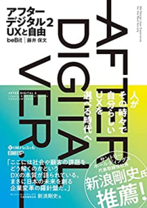

アフターデジタル社会になると、市場のルールが変わります。そのキーワードが「UX」です。社会の変革は下げようがないなら、新たなルールをいち早く学び、自分の立ち位置を決めて戦略を立ち上げます。この本はデジタルを強みにするには必読の書です。

リーダーが育つ変革プロジェクトの教科書

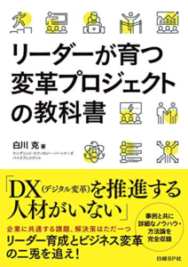

デジタルトランスフォーメーションを推進したくても、人材不足で足踏みをしている企業も少なくありません。本書はDXを人材教育の面から捉え、これからのデジタル競争を勝ち残れる人材育成のノウハウについて解説しています。

まとめ

DX（デジタルトランスフォーメーション）というと、その定義は曖昧で、各社の取り組みにはばらつきがあります。

企業内でデジタル技術を活用し、変革を起こして優位性を向上していく。そのためには、**他社の事例だけでなく、自社内の課題に向き合い、適材適所でデジタル技術を活用していくことが重要**ではないでしょうか。

DXは大変な取り組みで、浸透するまで必ずいろいろな試行錯誤が必要です。幸い、SaaSをはじめ、DXを進める環境は整備され、安価に小さくDXを始めることができるようになっています。ぜひ、この記事をきっかけに、小さなデジタイゼーション、デジタライゼーションを始めてみてください。

## SIer

## 其他

视频里那人事叫石川

